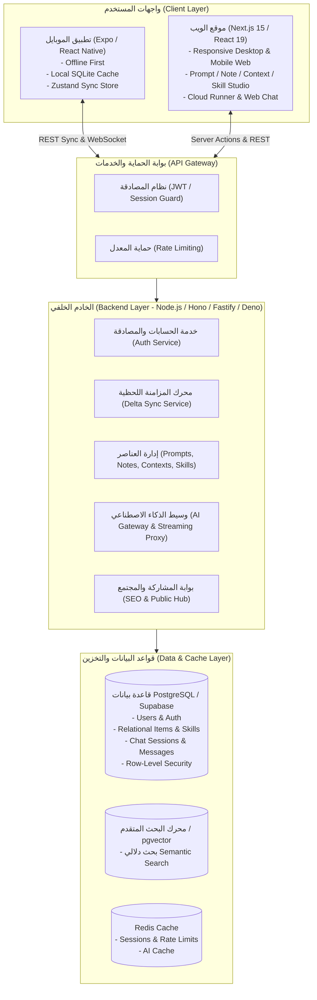
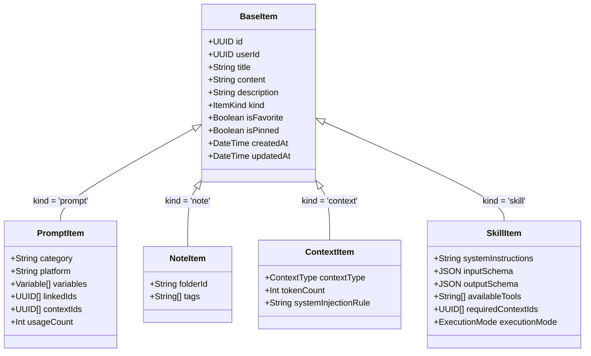
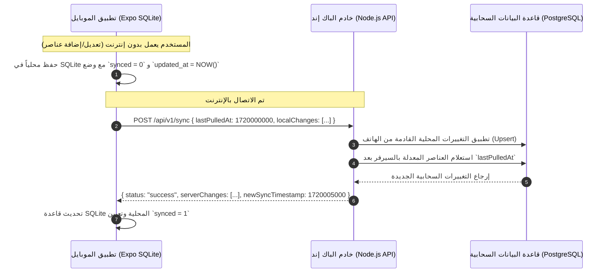

<div dir="rtl">

# وثيقة المواصفات الهندسية الشاملة: منصة الويب والباك إند وقاعدة البيانات — Vibe Note
### (Comprehensive Architecture & Database Specification for Vibe Note Web & Cloud Backend)

> **الهدف من الوثيقة:**  
> تقديم دراسة تفصيلية شاملة وتصميم تقني متكامل لنقل تطبيق **Vibe Note** من مجرد تطبيق موبايل يعمل محلياً (Offline-first على Expo / SQLite) إلى **منصة سحابية متكاملة (Cloud & Multi-User Platform)** تضم:
> 1. **موقع ويب (Web Application)** تفاعلي مع لوحة تحكم ومجتمع.
> 2. **خادم خلفي (Backend API)** متين وآمن.
> 3. **قاعدة بيانات سحابية (Multi-Tenant Cloud Database)** تدعم حسابات المستخدمين، المزامنة، حفظ البرومبتات، النوتات، السياقات، والمهارات (Skills).
> 4. **استراتيجية مزامنة سحابية (Cloud Sync)** تضمن استمرار عمل تطبيق Expo دون اتصال بالإنترنت مع مزامنة لحظية عند الاتصال.

---

## فهرس المحتويات
1. [تحليل وفهم هيكلية تطبيق Expo الحالي والدور الذي يلعبه](#1-تحليل-وفهم-هيكلية-تطبيق-expo-الحالي)
2. [الهندسة العامة للنظام الجديد (Web + Mobile + Backend)](#2-الهندسة-العامة-للنظام-الجديد)
3. [نظام المستخدمين والحسابات والمصادقة (Authentication & Authorization)](#3-نظام-المستخدمين-والحسابات-والمصادقة)
4. [مفهوم العناصر الأربعة: البرومبت، النوت، السياق، والمهارة (Skills)](#4-مفهوم-العناصر-الأربعة)
5. [تصميم مخطط قاعدة البيانات السحابية (Database Schema Design)](#5-تصميم-مخطط-قاعدة-البيانات-السحابية)
6. [مواصفات واجهات البرمجة (RESTful & Streaming API Specification)](#6-مواصفات-واجهات-البرمجة-api)
7. [استراتيجية المزامنة مع تطبيق الموبايل (Offline-First Sync Engine)](#7-استراتيجية-المزامنة-مع-تطبيق-الموبايل)
8. [هندسة موقع الويب (Web Frontend Architecture)](#8-هندسة-موقع-الويب)
9. [خارطة الطريق للتنفيذ مع الذكاء الاصطناعي (Prompting & Execution Roadmap)](#9-خارطة-الطريق-للتنفيذ)

---

## 1. تحليل وفهم هيكلية تطبيق Expo الحالي

### 1.1 ما هو تطبيق Vibe Note الحالي؟
تطبيق Vibe Note الحالي هو بيئة عمل متنقلة واحترافية لهندسة وتشغيل الأوامر البرمجية والذكاء الاصطناعي (AI Prompt Workspace & Runner) مصممة خصيصاً للمستخدمين الدائمين لنماذج الذكاء الاصطناعي (ChatGPT, Claude, Gemini, Midjourney, Cursor, Ollama...).

### 1.2 البنية البرمجية الحالية في Expo (`expo/src/`):
```text
expo/
├── src/
│   ├── components/       # مكونات الواجهة (بطاقات البرومبت، شريط البحث، محدد المتغيرات VariableFiller...)
│   ├── constants/        # التصنيفات (Categories)، المنصات (Platforms)، الثيمات (Themes)
│   ├── database/         # محرك SQLite المحلي (schema.ts, queries.ts, chatQueries.ts, seed.ts)
│   ├── engine/           # خوارزميات الاستخراج والذكاء:
│   │   ├── variableParser.ts  # تحليل متغيرات البرومبتات {{var:opt1|opt2}}
│   │   ├── aiService.ts       # تشغيل محادثات الذكاء (Gemini, Claude, OpenAI, Ollama)
│   │   └── importExport.ts    # تصدير واستيراد بصيغة .vibe v2
│   ├── stores/           # إدارة الحالة عبر Zustand (promptStore, chatStore, settingsStore...)
│   ├── screens/          # شاشات التطبيق (Home, PromptDetail, CreatePrompt, AIAssistant...)
│   └── types/            # تعريفات TypeScript لكافة الكيانات
```

### 1.3 الكيانات الأساسية الحالية في التخزين المحلي (SQLite):
1. **البرومبتات والنوتات والسياقات (`prompts` Table):**
   - الحقل الأساسي هو `kind`:
     - `prompt`: قالب أمر ذكاء اصطناعي يحتوي متغيرات قابلة للتعبئة.
     - `note`: أفكار ومسودات حرة بدون منصة أو متغيرات.
     - `context`: كتل سياقية قابلة لإعادة الاستخدام تُحقن كـ System Prompt في جلسات الشات.
   - التركيب والسلاسل (`linked_ids`): ربط برومبت بآخر لتشكيل "خطوات تالية" (Next-step prompt chains).
   - السياقات المرتبطة (`context_ids`): تحديد السياقات التي تُحقن تلقائياً عند تشغيل البرومبت.
   - المتغيرات (`variables`): تُخزن كـ JSON وتحتوي `name, type, options, defaultValue, recentValues`.
2. **جلسات ومحادثات الذكاء الاصطناعي (`chat_sessions` & `chat_messages`):**
   - جلسات دردشة متواصلة ومحفوظة، تدعم التثبيت والحذف وتوليد العناوين التلقائي.
   - كل رسالة ترتبط برقم جلسة (`session_id`) ودور (`role: user | assistant | system`) ومعرّف البرومبت المشغّل (`prompt_id`).
   - إمكانية تحويل أي رد شات فوراً إلى نوت أو برومبت.
3. **تاريخ الاستخدام (`usage_history`):**
   - تسجيل القيم التي ملأها المستخدم في كل مرة يشغّل فيها برومبت للاسترجاع السريع.
4. **البحث السريع (FTS5):**
   - جدول وهمي `prompts_fts` مدعوم بـ SQLite Triggers لترتيب النتائج بنظام BM25.

### 1.4 نقاط القصور التي تستوجب الانتقال للسحابة والويب:
* **عزلة البيانات:** البيانات محبوسة داخل جهاز واحد، إذا غيّر المستخدم هاتفه أو مسح التطبيق يفقد كل مكتبته ما لم يقم بنسخ احتياطي يدوي.
* **غياب حساب المستخدم:** لا يوجد نظام تسجيل دخول (Authentication) أو حماية عبر السحابة.
* **العمل من المتصفح (Web Access):** مهندسو الأوامر البرمجية وصناع المحتوى يقضون أغلب أوقاتهم على أجهزة الكمبيوتر، والحاجة إلى موقع ويب يدخل إليه المستخدم بحسابه ويجد كافة برومبتاته ونوتاته أمر جوهري.
* **المشاركة المجتمعية والسوق (Community & Sharing):** لا يمكن حالياً مشاركة البرومبتات والمهارات مع فريق أو مع العامة برابط تفاعلي إلا عبر حل بدائي جزئي.

---

## 2. الهندسة العامة للنظام الجديد (Web + Mobile + Backend)



---

## 3. نظام المستخدمين والحسابات والمصادقة

### 3.1 آليات التسجيل والدخول:
1. **البريد الإلكتروني وكلمة المرور (Email + Password):**
   - تشفير كلمات المرور باستخدام خوارزمية **Argon2id** أو **Bcrypt** (Salt rounds 12).
   - التحقق من البريد الإلكتروني عبر رمز OTP أو رابط تحقق.
2. **الدخول الاجتماعي (OAuth 2.0 / OpenID Connect):**
   - تسجيل فوري بنقرة واحدة عبر **Google** و **GitHub** (الأكثر أهمية للمطورين ومهندسي الذكاء الاصطناعي).
3. **الجلسات والرموز الأمنية (Token Architecture):**
   - **Access Token:** مدة صلاحيته قصيرة (15 دقيقة)، يُرسل في ترويسة الطلبات `Authorization: Bearer <token>`.
   - **Refresh Token:** مدة صلاحيته طويلة (30-60 يوماً)، يُخزن في الويب داخل **HttpOnly, Secure Cookie**، وفي الموبايل داخل **`expo-secure-store`** المقفول عتادياً.
   - إمكانية إنهاء كافة الجلسات النشطة من أجهزة أخرى (Session Invalidation).

### 3.2 مستويات المستخدمين والصلاحيات (Roles & Tenancy):
* `free_user`: يملك حفظ عدد محدد من العناصر وسعة سحابية قياسية واستخدام مفاتيحه الخاصة (BYOK).
* `pro_user`: سعة غير محدودة، بحث دلالي عبر التضمينات (Embeddings)، سياقات موسعة، وإمكانية مشاركة بروابط خاصة ومحمية بكلمة سر.
* `admin`: لوحة تحكم لفحص المحتوى المشبوه وإدارة التبليغات وتصنيفات المجتمع.

---

## 4. مفهوم العناصر الأربعة: البرومبت، النوت، السياق، والمهارة (Skills)

في منصة Vibe Note المطورة، يتم تصنيف أصول المعرفة إلى 4 ركائز رئيسية:



### شرح الركائز بالتفصيل:

1. **البرومبت (Prompt Template):**
   - أمر مخصص وقابل لإعادة الاستخدام يحتوي متغيرات `{{topic}}` أو قوائم خيارات `{{tone:formal|casual}}`.
   - يربط بمنصة مستهدفة (ChatGPT, Midjourney...) وتصنيف محدد، وسلاسل خطوات تالية (Prompt Composition Chains).

2. **النوت (Note):**
   - نصوص حرة، مقتطفات برمجية، إجابات تم توليدها من الذكاء الاصطناعي وحفظها للمستقبل، أفكار أولية غير مهيكلة كقوالب.

3. **السياق (Context Block):**
   - كتلة معرفية مركزية تُحقن في عقل النموذج كـ `System Instruction`.
   - *أمثلة:* "دليل الهوية البصرية للشركة"، "قواعد كتابة كود Clean Architecture"، "شخصية خبير قانوني سعودي". يمكن ربط السياق بعدة برومبتات أو بجلسات دردشة كاملة.

4. **المهارة (Skill - الإضافة الجوهرية الجديدة):**
   - **المهارة هي قدرة ذكاء اصطناعي متقدمة وشبه ذاتية (Autonomous Agent Skill).**
   - لا تكتفي بكونها نصاً؛ بل تحتوي:
     - **تعليمات النظام (System Prompt & Persona):** أسلوب التفكير وطريقة معالجة المهام.
     - **مخطط المدخلات (Input Variables Schema):** بيانات متكاملة تطلب من المستخدم قبل التنفيذ.
     - **السياقات الإجبارية (Attached Contexts):** ملفات أو نصوص سياقية تتطلبها هذه المهارة دائماً.
     - **الأدوات والمخرجات المستهدفة (Tools & Output Specification):** كود، جدول، تحليل، JSON، إلخ.
     - **مسار التنفيذ التلقائي (Workflow / Pipeline):** إمكانية تشغيل أكثر من خطوة تتابعياً دون تدخل المستخدم.

---

## 5. تصميم مخطط قاعدة البيانات السحابية (Database Schema Design)

فيما يلي المخطط القياسي الكامل باستخدام **PostgreSQL** (الموصى به بشدة مع Supabase أو خادم مستقل):

```sql
-- =================================================================
-- 1. تفعيل الإضافات الضرورية
-- =================================================================
CREATE EXTENSION IF NOT EXISTS "uuid-ossp";
CREATE EXTENSION IF NOT EXISTS "pg_trgm"; -- للبحث بالنصوص والأخطاء الإملائية

-- =================================================================
-- 2. جدول المستخدمين (Users & Authentication)
-- =================================================================
CREATE TABLE users (
    id UUID PRIMARY KEY DEFAULT uuid_generate_v4(),
    email VARCHAR(255) UNIQUE NOT NULL,
    password_hash VARCHAR(255), -- NULL في حال التسجيل عبر OAuth
    full_name VARCHAR(100),
    avatar_url TEXT,
    role VARCHAR(20) DEFAULT 'user' CHECK (role IN ('user', 'pro', 'admin')),
    email_verified BOOLEAN DEFAULT FALSE,
    created_at TIMESTAMPTZ NOT NULL DEFAULT NOW(),
    updated_at TIMESTAMPTZ NOT NULL DEFAULT NOW(),
    deleted_at TIMESTAMPTZ -- للحذف المرن Soft Delete
);

CREATE INDEX idx_users_email ON users(email) WHERE deleted_at IS NULL;

-- =================================================================
-- 3. جدول إعدادات ومفاتيح المستخدم (User Preferences & AI Keys)
-- =================================================================
CREATE TABLE user_settings (
    user_id UUID PRIMARY KEY REFERENCES users(id) ON DELETE CASCADE,
    theme VARCHAR(30) DEFAULT 'dark',
    language VARCHAR(10) DEFAULT 'ar',
    default_ai_provider VARCHAR(50) DEFAULT 'gemini',
    -- المفاتيح تُخزن مشفرة بواسطة مفتاح تشفير رئيسي في السيرفر (AES-256-GCM)
    encrypted_ai_keys JSONB DEFAULT '{}'::jsonb,
    custom_categories JSONB DEFAULT '[]'::jsonb,
    custom_platforms JSONB DEFAULT '[]'::jsonb,
    updated_at TIMESTAMPTZ NOT NULL DEFAULT NOW()
);

-- =================================================================
-- 4. جدول العناصر الرئيسي (Items: Prompts, Notes, Contexts, Skills)
-- =================================================================
CREATE TYPE item_kind_enum AS ENUM ('prompt', 'note', 'context', 'skill');

CREATE TABLE items (
    id UUID PRIMARY KEY DEFAULT uuid_generate_v4(),
    user_id UUID NOT NULL REFERENCES users(id) ON DELETE CASCADE,
    kind item_kind_enum NOT NULL DEFAULT 'prompt',
    title VARCHAR(255) NOT NULL,
    content TEXT NOT NULL,
    description TEXT,
    
    -- خاص بالبرومبتات والمهارات
    category VARCHAR(50) DEFAULT 'other',
    platform VARCHAR(50) DEFAULT 'other',
    variables JSONB DEFAULT '[]'::jsonb,
    
    -- سلاسل الربط وتوزيع السياقات
    linked_item_ids UUID[] DEFAULT ARRAY[]::UUID[], -- تركيب الخطوات التالية
    attached_context_ids UUID[] DEFAULT ARRAY[]::UUID[], -- السياقات المحقونة
    
    -- تصنيفات وفهارس إضافية
    tags TEXT[] DEFAULT ARRAY[]::TEXT[],
    folder_id UUID,
    
    -- خصائص التفضيل والاستخدام
    is_favorite BOOLEAN DEFAULT FALSE,
    is_pinned BOOLEAN DEFAULT FALSE,
    usage_count INTEGER DEFAULT 0,
    last_used_at TIMESTAMPTZ,
    
    -- بيانات إضافية مخصصة للمهارات (Skills)
    skill_config JSONB DEFAULT NULL, -- { "tools": [], "outputFormat": "markdown", "schema": {} }
    
    -- تتبع المزامنة وإصدارات الكيان
    version INTEGER NOT NULL DEFAULT 1,
    created_at TIMESTAMPTZ NOT NULL DEFAULT NOW(),
    updated_at TIMESTAMPTZ NOT NULL DEFAULT NOW(),
    deleted_at TIMESTAMPTZ -- لحذف العناصر سحابياً مع إبلاغ الموبايل بالحذف
);

-- فهارس الأداء العالي
CREATE INDEX idx_items_user_kind ON items(user_id, kind) WHERE deleted_at IS NULL;
CREATE INDEX idx_items_tags ON items USING GIN(tags);
CREATE INDEX idx_items_updated ON items(user_id, updated_at);

-- =================================================================
-- 5. جدول النشر المجتمعي والمشاركة (Public Showcase & Community)
-- =================================================================
CREATE TABLE shared_items (
    id UUID PRIMARY KEY DEFAULT uuid_generate_v4(),
    item_id UUID REFERENCES items(id) ON DELETE CASCADE,
    author_id UUID REFERENCES users(id) ON DELETE SET NULL,
    short_slug VARCHAR(32) UNIQUE NOT NULL, -- للروابط المختصرة مثل vibenote.sbs/p/abc123
    is_public BOOLEAN DEFAULT TRUE,
    view_count INTEGER DEFAULT 0,
    copy_count INTEGER DEFAULT 0,
    fork_count INTEGER DEFAULT 0,
    created_at TIMESTAMPTZ NOT NULL DEFAULT NOW()
);

CREATE INDEX idx_shared_slug ON shared_items(short_slug);

-- =================================================================
-- 6. جدول جلسات الدردشة المحفوظة (Chat Sessions)
-- =================================================================
CREATE TABLE chat_sessions (
    id UUID PRIMARY KEY DEFAULT uuid_generate_v4(),
    user_id UUID NOT NULL REFERENCES users(id) ON DELETE CASCADE,
    title VARCHAR(255) NOT NULL,
    provider_id VARCHAR(50),
    model VARCHAR(100),
    attached_context_ids UUID[] DEFAULT ARRAY[]::UUID[],
    is_pinned BOOLEAN DEFAULT FALSE,
    created_at TIMESTAMPTZ NOT NULL DEFAULT NOW(),
    updated_at TIMESTAMPTZ NOT NULL DEFAULT NOW(),
    deleted_at TIMESTAMPTZ
);

CREATE INDEX idx_chat_sessions_user ON chat_sessions(user_id, updated_at DESC) WHERE deleted_at IS NULL;

-- =================================================================
-- 7. جدول رسائل الدردشة (Chat Messages)
-- =================================================================
CREATE TABLE chat_messages (
    id UUID PRIMARY KEY DEFAULT uuid_generate_v4(),
    session_id UUID NOT NULL REFERENCES chat_sessions(id) ON DELETE CASCADE,
    user_id UUID NOT NULL REFERENCES users(id) ON DELETE CASCADE,
    role VARCHAR(20) NOT NULL CHECK (role IN ('user', 'assistant', 'system')),
    content TEXT NOT NULL,
    prompt_id UUID, -- البرومبت الذي أطلق هذا التوليد إن وجد
    created_at TIMESTAMPTZ NOT NULL DEFAULT NOW()
);

CREATE INDEX idx_chat_messages_session ON chat_messages(session_id, created_at ASC);

-- =================================================================
-- 8. جدول سجل ملء المتغيرات (Usage History)
-- =================================================================
CREATE TABLE usage_history (
    id UUID PRIMARY KEY DEFAULT uuid_generate_v4(),
    user_id UUID NOT NULL REFERENCES users(id) ON DELETE CASCADE,
    prompt_id UUID NOT NULL REFERENCES items(id) ON DELETE CASCADE,
    values_json JSONB NOT NULL DEFAULT '{}'::jsonb,
    created_at TIMESTAMPTZ NOT NULL DEFAULT NOW()
);

CREATE INDEX idx_usage_user_prompt ON usage_history(user_id, prompt_id, created_at DESC);
```

---

## 6. مواصفات واجهات البرمجة (RESTful & Streaming API Specification)

تتبع الواجهات معيار RESTful JSON مع حماية بـ JWT و CORS كامل.

### 6.1 واجهات الحسابات والمصادقة (`/api/v1/auth`)
| المسار (Endpoint) | الطريقة | الوصف | البيانات المرسلة (Payload) |
|---|---|---|---|
| `/api/v1/auth/signup` | `POST` | إنشاء حساب جديد بالبريد وكلمة السر | `{ email, password, fullName }` |
| `/api/v1/auth/login` | `POST` | تسجيل الدخول واستلام التوكن | `{ email, password }` |
| `/api/v1/auth/google` | `POST` | تسجيل ودخول عبر Google OAuth | `{ idToken }` |
| `/api/v1/auth/refresh` | `POST` | تجديد Access Token المنتهي | `{ refreshToken }` أو عبر HttpOnly Cookie |
| `/api/v1/auth/logout` | `POST` | تسجيل الخروج وإبطال الرمز | - |
| `/api/v1/auth/me` | `GET` | بيانات الحساب الحالي والإعدادات | Header: `Authorization: Bearer <token>` |

### 6.2 واجهات العناصر ومكتبة البرومبتات (`/api/v1/items`)
| المسار | الطريقة | الوصف |
|---|---|---|
| `/api/v1/items` | `GET` | جلب العناصر مع إمكانية التصفية (`?kind=prompt&category=code&search=...`) |
| `/api/v1/items` | `POST` | إنشاء عنصر جديد (برومبت، نوت، سياق، أو مهارة) |
| `/api/v1/items/:id` | `GET` | جلب تفاصيل عنصر محدد مع سياقاته وروابطه |
| `/api/v1/items/:id` | `PUT` | تحديث بيانات العنصر |
| `/api/v1/items/:id` | `DELETE` | نقل العنصر لسلة المهملات / حذف مرن |
| `/api/v1/items/:id/use` | `POST` | تسجيل تشغيل برومبت وتحديث عداد الاستخدام وحفظ المتغيرات |

### 6.3 واجهات المهارات المتخصصة (`/api/v1/skills`)
| المسار | الطريقة | الوصف |
|---|---|---|
| `/api/v1/skills` | `GET` | جلب قائمة المهارات المتاحة للمستخدم |
| `/api/v1/skills/:id/run` | `POST` | تشغيل مهارة بمدخلات محددة وحقن السياقات المطلوبة وإرجاع الناتج |

### 6.4 واجهات الدردشة والذكاء الاصطناعي (`/api/v1/chat`)
| المسار | الطريقة | الوصف |
|---|---|---|
| `/api/v1/chat/sessions` | `GET` | جلب جلسات الدردشة للمستخدم |
| `/api/v1/chat/sessions` | `POST` | بدء جلسة دردشة جديدة |
| `/api/v1/chat/sessions/:id/messages` | `GET` | جلب سجل رسائل الجلسة |
| `/api/v1/chat/sessions/:id/send` | `POST` | إرسال رسالة واستقبال الرد كبث لحظي (Server-Sent Events: SSE) |

### 6.5 واجهة المزامنة التفاضلية لمطبيق الموبايل (`/api/v1/sync`)
| المسار | الطريقة | الوصف |
|---|---|---|
| `/api/v1/sync` | `POST` | تبادل التغييرات بين الموبايل والسيرفر منذ آخر توقيت مزامنة (`since_timestamp`) |

---

## 7. استراتيجية المزامنة مع تطبيق الموبايل (Offline-First Sync Engine)

لضمان عدم خسارة سرعة واستجابة تطبيق الموبايل الحالية، يجب تطبيق نمط **Offline-First**:



### قواعد فض التعارضات (Conflict Resolution Rules):
1. **قاعدة الكتابة الأحدث تفوز (Last-Write-Wins - LWW):** مقارنة توقيت `updated_at` بين السحابة والهاتف، ويُعتمد الأحدث.
2. **الحذف الآمن (Soft Deletes):** لا تُحذف السجلات فوراً بـ `DELETE FROM`؛ بل يُعين حقل `deleted_at`. يقوم الموبايل أثناء المزامنة بحذف السجل محلياً عند رؤية `deleted_at != null`.

---

## 8. هندسة موقع الويب (Web Frontend Architecture)

### 8.1 حزمة التقنيات المقترحة لموقع الويب (Recommended Stack):
* **Framework:** **Next.js 15 (App Router)** مع React 19.
* **Styling & UI:** **Tailwind CSS** مع مكتبة **Shadcn UI** (متناسقة تماماً مع التصميم النظيف لموبايل Vibe Note).
* **State Management:** **Zustand** (لإعادة استخدام نفس المنطق ومخازن الحالة الموجودة في تطبيق Expo).
* **Icons:** **Lucide React** (مطابقة لأيقونات `@expo/vector-icons`).
* **Markdown & Syntax Highlighting:** `react-markdown` + `shiki` لعرض كود وأوامر الذكاء الاصطناعي بشكل أنيق.

### 8.2 الهيكلة التفاعلية لشاشات الويب:
1. **لوحة التحكم الموحدة (Dashboard):**
   - تبويبات علوية: **البرومبتات (Prompts)** | **النوتات (Notes)** | **السياقات (Contexts)** | **المهارات (Skills)**.
   - فلترة سريعة حسب المنصة (ChatGPT, Claude...) والتصنيف، مع شريط بحث حي يدعم البحث الدلالي.
2. **استوديو تشغيل البرومبت التفاعلي (Interactive Prompt Runner):**
   - عند فتح أي برومبت، يظهر نموذج جانبي تفاعلي يُنشئه محرك `variableParser` آلياً لحقول `{{var}}` والخيارات المنسدلة.
   - زر مباشر: "تشغيل عبر الذكاء الاصطناعي" يفتح واجهة المحادثة المباشرة مع بث الردود (Streaming).
3. **محرر المهارات والسياقات (Skill & Context Studio):**
   - بناء سياقات الشركات أو أسلوب الكتابة وإرفاقها بالمهارات.
   - تجربة المهارة فوراً ورؤية النتائج مباشرة في المتصفح.
4. **دليل المجتمع والمشاركة العامة (Public Community Hub):**
   - روابط ويب عامة (SEO-friendly) لكل برومبت أو مهارة يختار المستخدم نشرها للعامة.
   - إمكانية نسخ الأمر بنقرة زر واحدة أو عمل **"Fork"** وحفظه مباشرة في حساب المستخدم الخاص.

---

## 9. خارطة الطريق للتنفيذ مع الذكاء الاصطناعي (Roadmap & Prompts)

يمكنك دراسة هذه الخطة وتطبيقها خطوة بخطوة مع نماذج الذكاء الاصطناعي على النحو التالي:

### المرحلة الأولى: تأسيس قاعدة البيانات ونظام المصادقة (Backend Core & Auth)
* **المهمة:** إعداد خادم (Node.js/Express أو Hono أو NestJS) متصل بقاعدة بيانات PostgreSQL ومجهز بـ Prisma أو Drizzle ORM.
* **البرومبت المقترح لتغذية الذكاء الاصطناعي:**
  > "أنشئ لي مشروع Backend بلغة TypeScript باستخدام Hono/Node.js مع قاعدة بيانات PostgreSQL ومكتبة Drizzle ORM بناءً على مخطط الجداول وقواعد الـ Auth المذكورة في وثيقة Vibe Note. أريد الـ Endpoints الخاصة بإنشاء الحساب، تسجيل الدخول، وتوليد JWT Access & Refresh Tokens."

### المرحلة الثانية: واجهات برمجة العناصر والمزامنة (Items & Sync APIs)
* **المهمة:** برمجة الـ Endpoints لكافة أنواع العناصر الأربعة (برومبت، نوت، سياق، مهارة) مع مسار المزامنة التفاضلية `/api/v1/sync`.

### المرحلة الثالثة: بناء موقع الويب (Next.js 15 Web Studio)
* **المهمة:** إنشاء تطبيق Next.js يضم نظام الدخول، استعراض العناصر، تشغيل القوالب، واستوديو الدردشة مع نماذج الذكاء عبر SSE.

### المرحلة الرابعة: ربط تطبيق الموبايل الحالي بالسحابة (Expo Cloud Connection)
* **المهمة:** تعديل `database/queries.ts` و `stores/promptStore.ts` في تطبيق Expo لدعم تسجيل الدخول وتفعيل خلفية المزامنة (Sync Engine).

---

## ملخص نهائي
هذا التصميم ينقل مشروع **Vibe Note** من كونه تطبيق نوتات بسيط على الهاتف إلى **نظام بيئي شامل لمهندسي الذكاء الاصطناعي (AI Prompt & Skill Ecosystem)** يربط الهاتف بالمتصفح، ويوفر بيئة عمل سريعة، منظمة، وتشاركية.

</div>
